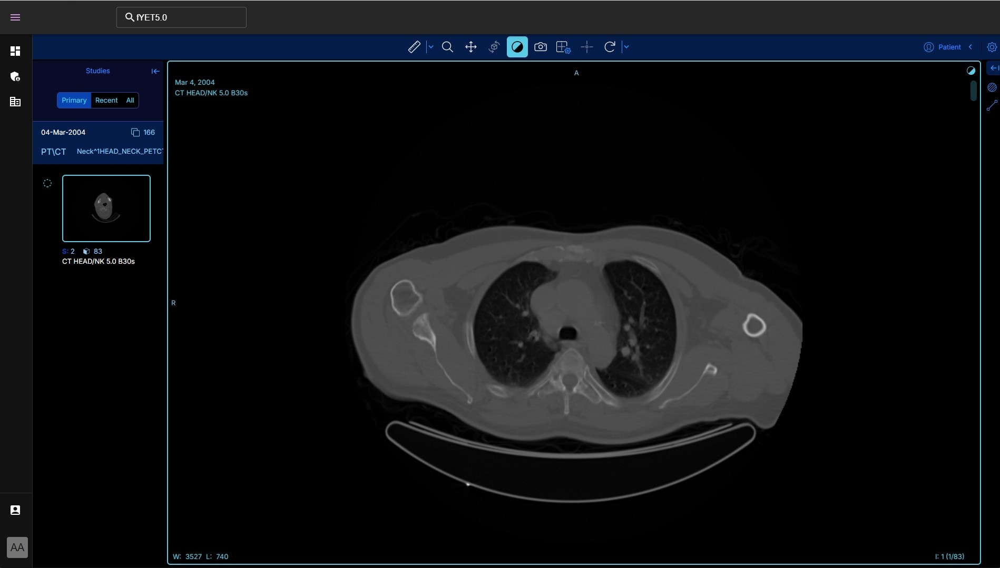

# Med Image Scanner App
[](https://github.com/suxrobgm/med-image-scanner/actions/workflows/backend-ci.yml)

The monorepo for the Med Image Scanner app. It contains the following apps/services:
- [Frontend](./frontend/)
- [Backend](./backend/)
- [OHIF Viewer](./viewer/)
- [ML App](./ml/)


## How to run containers
1. Install Docker and Docker Compose. Follow the instructions [here](https://docs.docker.com/get-docker/) and [here](https://docs.docker.com/compose/install/).

2. Run the containers:
```bash
docker compose up
```

## Documentation
- Read about the project architecture here: [Architecture](./docs/architecture.md)
- Read on how to use the app here: [User Guide](./docs/user-guide.md)

## Sample Screenshots




