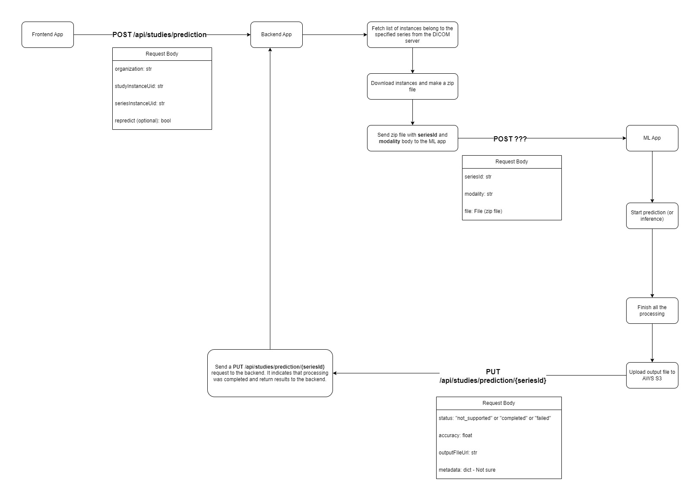

# Interaction with ML Models

This document outlines the process of interacting with the Machine Learning (ML) models in the backend. The ML models are hosted in a separate application that runs in its own container. Communication between the backend and the ML models application is facilitated by the `MLService` class. The ML models application is responsible for loading the models, processing DICOM series data, and returning prediction results.

## Overview

The [MLService](../src/application/services/ml_service.py) class is the primary interface for interacting with the ML models. This class handles the communication with the ML models application by sending HTTP requests. Specifically, the `send_for_prediction()` method is used to send a request to the ML models application to obtain predictions for a specific series of DICOM study data. The method requires a series ID and the path to a ZIP file containing the series instances.

## Available APIs for ML Model Interaction

There are two primary APIs available for interacting with the ML models:

### 1. POST `/api/studies/series/predict`

This API endpoint is used to initiate a prediction request for a single series of DICOM study data. The workflow involves the following steps:

1. **Frontend Request**: The frontend triggers this API to start the prediction process for a specific series.
2. **Series Retrieval and ZIP Creation**: The backend fetches the series instances from the organization’s DICOM server, packages them into a ZIP file, and sends this file to the ML models application.
3. **Prediction Processing**: The ML models application processes the received ZIP file, runs the ML model inference, and returns the prediction result.
4. **Background Task**: All processing is handled asynchronously in a background task queue to ensure non-blocking operations.

#### ZIP File Structure

The ZIP file sent to the ML models application contains the DICOM series instances and follows the structure below:

```
dicom_{study_instance_uid}_{series_instance_uid}.zip
├── {modality}_{instance_number}.dcm
├── ...

Example:
dicom_1.2.840.113745.101000.1008000.38048.4626.5933732_1.3.12.2.1107.5.1.4.36085.2.0.3752006615092156.zip
├── CT_1.dcm
├── CT_2.dcm
├── CT_3.dcm
├── ...
```

#### Parameters

- **`organization`**: The organization’s ID or name associated with the study.
- **`studyInstanceUid`**: The unique identifier (UID) for the study associated with the series.
- **`seriesInstanceUid`**: The unique identifier (UID) for the specific series being analyzed.
- **`modelType`**: The type of ML model to use for prediction. 
- **`predictAgain`** (optional): A boolean flag that controls whether the series should be re-predicted. If `true`, the ML models application will re-run the prediction even if it has been previously completed. If `false`, the request will skip the prediction process if the series has already been processed.

### 2. PUT `/api/studies/series/{series_id}/status`

This API endpoint is used by the ML models application to update the backend with the prediction status of a series after processing. The following occurs when this API is called:

1. **ML Processing Completion**: After processing the series, the ML models application sends the prediction result back to the backend.
2. **Backend Update**: The backend updates the prediction status and other relevant details for the series in the database.

#### Parameters

- **`status`**: The status of the prediction process. It can be one of the following:
  - `not_supported`: The series or modality is not supported by the ML model.
  - `completed`: The prediction process was successful, and results are available.
  - `failed`: The prediction process failed.
- **`modelType`**: The type of ML model used for prediction.
- **`result`**: The prediction result data, including the predicted class, probability, and other relevant information.

## Workflow Summary

1. **Initiation**: The frontend triggers the prediction process by calling the POST `/api/studies/series/predict` API.
2. **Series Processing**: The backend retrieves the series, packages it, and sends it to the ML models application.
3. **ML Inference**: The ML models application processes the series and returns the prediction results. This process may take from a few seconds to several minutes.
4. **Result Handling**: The backend receives the results via the PUT `/api/studies/series/{series_id}/status` API and updates the database accordingly.

### Workflow Diagram

Below is a visual representation of the interaction workflow between the backend and the ML models application:


