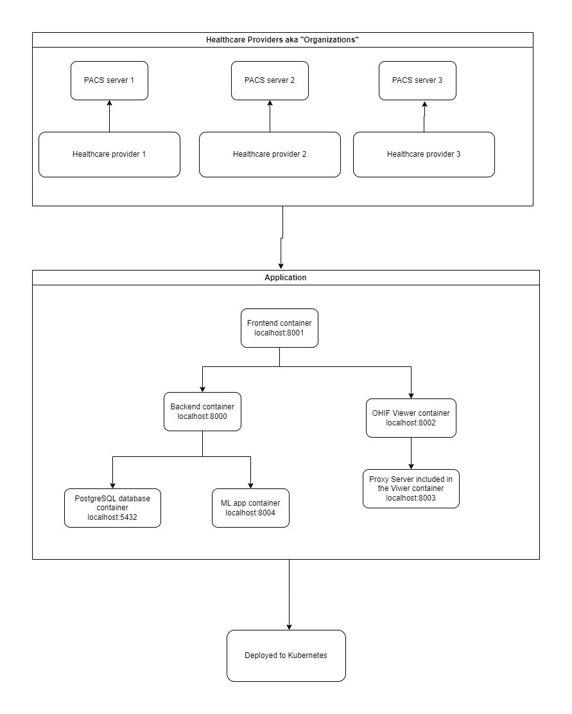

# Project Overview

The application is a web-based platform that allows healthcare providers to view and analyze medical images such as X-rays, CT scans, and MRIs. The platform provides tools to view images, annotate them, and perform image analysis using machine learning models. The platform is designed as a companion tool for radiologists and other healthcare providers to help them diagnose diseases. It uses the DICOM standard to retrieve and display medical images from healthcare providers’ Picture Archiving and Communication System (PACS) servers.

## Project Architecture

The project is divided into the following directories:

- `backend`: Contains the backend code. Used FastAPI as the web framework and SQLModel as the ORM. Jinja2 is used as the templating engine for email templates.
- `frontend`: Contains the frontend code. Used Next.js 14 as the frontend framework and Material-UI as the UI library. Auth.js is used for authentication.
- `ml`: Contains the ML models and integration API.
- `viewer`: Contains the OHIF viewer. There is also a proxy server to handle the DICOM requests.
- `k8s`: Contains the Kubernetes deployment files.

All the directories contain a `README.md` file that explains how to run the code in a local development environment. All applications are containerized using Docker and can be deployed to Kubernetes.
The following ports are used by the applications:

- Backend: 8000
- Frontend: 8001
- Viewer: 8002
- Proxy: 8003
- ML: 8004

You can also simply run the applications using the `docker-compose` command instead of running them individually. The `docker-compose.yml` file is located in the root directory. To run the applications, use the following command:

```bash
docker compose up
```

## Overall Architecture Diagram



## Backend

The backend is a FastAPI application that serves the frontend and provides an REST API. Used Domain Driven Design (DDD) architecture to structure the codebase. The `src` directory contains the following directories:

- `application`: Contains the application business logic. This is where the use cases are implemented using the Command Query Responsibility Segregation (CQRS) pattern.
  - `commands`: Contains the command definitions and handlers. Commands are used to perform write operations such as creating, updating, and deleting entities.
  - `queries`: Contains the query definitions and handlers. Queries are used to perform read operations such as fetching entities from the database.
  - `services`: Contains the service classes that contain the business logic that is shared across multiple use cases.
  - `models`: Contains the data transfer objects (DTOs) that are used to transfer data between the application and the frontend app.
  - `email_templates`: Contains the email templates that are used to send emails to the users.
  - `utils`: Contains utility and helper functions that are used across the application.

- `domain`: Contains the domain entities, value objects and enums. The domain entities are the core business objects that are persisted in the database. The value objects are immutable objects that are used to represent the attributes of the domain entities.
- `infrastructure`: Contains the infrastructure code such as database connection settings, repositories, and unit of work implementation. Used SQLModel as the ORM to interact with the database.
  - `migrations`: Contains the Alembic migration scripts that are used to create and update the database schema. To read more about migrations, please read migrations [guide](../backend/docs/migration-guide.md).

- `presentation`: Contains the presentation layer code such as the API routes and seeding database.
  - `routers`: Contains the API routes that define the REST endpoints. To view the API documentation, visit the `/docs` endpoint.
  - `seed_db.py`: Contains the script to seed the database with initial data.
- `core`: Contains implementation of the architecture related core classes such as Dependency Injection and Mediator.

### Use Cases

To create a new use case, follow these steps:

1. Create a new folder in the `application/commands` or `application/queries` directory with the name of the use case.
2. Create a new command or query class in the folder with the name of the use case. Give the class name `command.py` or `query.py`..
3. Implement the command or query handler in the `handler.py` file.
4. Decorate the handler with the `@Mediator.register_handler(${Command or query class})` decorator. In the constructor (`__init__`) of the handler, inject the required services and unit of work classes. To access the database session, you need to first inject `UnitOfWork` class then create a repository for the entity you want to interact with. For example,

```python
@Mediator.register_handler(CreatePatientCommand)
class CreatePatientHandler(RequestHandler[CreatePatientCommand, Result]):
    def __init__(self, uow: UnitOfWork):
        self.uow = uow
    
    def handle(self, command: CreatePatientCommand) -> Result:
        patient_repo = self.uow.get_repository(Patient)
        # Perform database operations here by calling the repository methods.
```

### Dependency Injection

The application uses the custom built Dependency Injection (DI) container to manage the dependencies. The DI container is implemented using the `DIContainer` class in the `core` module. To register a new dependency, you need to decorate the class with the `@DIContainer.register_service()` decorator. For example,

```python
@DIContainer.register_service(ServiceLifecycle.TRANSIENT)
class MyService:
    def __init__(self, dependency: Dependency):
        self.dependency = dependency
```

There's also FastAPI built-in dependency injection used in the API routes. This DI is used only in the endpoint router functions. In other parts of the application, the custom DI container is used.

## Frontend

The frontend is a Next.js application that uses Material-UI as the UI library. The `src` directory contains the following directories:

- `components`: Contains the reusable components that are used across multiple pages.
- `app`: Contains app routes along with the layout and page components.
- Each page has a corresponding directory with the page components. For example, the `app/auth/signin` directory contains the components for the sign-in page (`app/auth/signin/page.tsx`).
- `core`: Contains shared services, hooks, utils, and DTOs.

Prefer to use PascalCase file naming convention for all source files except for special Next.js files such as `index.ts`, `page.tsx`, `layout.tsx`, etc.

### Services

- `ApiService`: It's a singleton service that is used to make API requests to the backend. It uses native fetch API to make requests. These methods are server-side rendered (SSR) compatible. To call these methods in client components (components where marked as `"use client"`). Use useSWR hook from SWR library to fetch data from the API.
- `IPInfoService`: A singleton service that is used to get the user's IP address and location information. It uses the ipinfo.io API to get the information. The token is stored in the `.env` file.

## AI

The `ai` directory contains the DL models and integration API. The `src` directory contains the following directories:

- `dto`: Contains the data transfer objects (DTOs) that are used to transfer data between the backend and the ML models.
- `models`: Contains the ML models that are used to predict disease based on the input data.
- `services`: Contains the service classes that are used to interact with the DL models and perform predictions and send the results back to the backend.
- `utils`: Contains utility and helper functions that are used across the DL application. Some of the utility functions are used to preprocess the input data before passing it to the DL models such as converting the DICOM images to PNG format.

Read the [AI Interaction](../backend/docs/ai-interaction.md) guide to understand how the AI models are integrated with the backend application.

## Viewer

The viewer directory contains the OHIF viewer. In the `ohif` directory, contains precompiled OHIF viewer code. Only the `app-config.js` can be modified to change the configuration of the viewer. If you want to add a new extension or add a new functionality to the viewer, you need to clone the OHIF viewer [repository](https://github.com/OHIF/Viewers) and make the changes there. Then build the viewer and copy the compiled code to the `ohif` directory.
The `express` server is used to serve static files of the OHIF viewer. The `cors-anywhere` package is used to handle the CORS issues and proxy the requests to the PACS server.

## Kubernetes

In the `k8s` directory, contains the Kubernetes deployment files to deploy the applications to Azure Kubernetes Service (AKS). The following files are present in the directory:

- `backend.yaml`: Contains the deployment and service manifest files for the backend application.
- `frontend.yaml`: Contains the deployment and service manifest files for the frontend application.
- `ai.yaml`: Contains the deployment and service manifest files for the ML application.
- `viewer.yaml`: Contains the deployment and service manifest files for the viewer and proxy applications.
- `database.yaml`: Contains the deployment and service manifest files for the PostgreSQL database.
- `ingress.yaml`: Contains the ingress manifest file to route the traffic to the backend, frontend, ml, viewer and proxy services.
- `loadbalancer.yaml`: Contains an optional manifest file to create a load balancer service to expose the applications for testing purposes.
- `cert-issuer.yaml`: Contains the cert-manager issuer manifest file to issue the SSL certificates for the applications with Let's Encrypt.

There is a `helm` directory that contains PowerShell scripts to install or unistall **nginx ingress** and **cert-manager** services.

## CI/CD

The project uses GitHub Actions for CI/CD. The workflows are defined in the `.github/workflows` directory. The following workflows are defined:

- `backend-ci.yml`: Contains the CI workflow for the backend application. It runs the tests and linters on every push to the `main` branch.
- `deploy-aks.yml`: Contains the CD workflow to deploy the applications to AKS. It runs when a new release is created. The workflow builds the Docker images, pushes them to the Azure Container Registry, and then deploys the applications to AKS.
