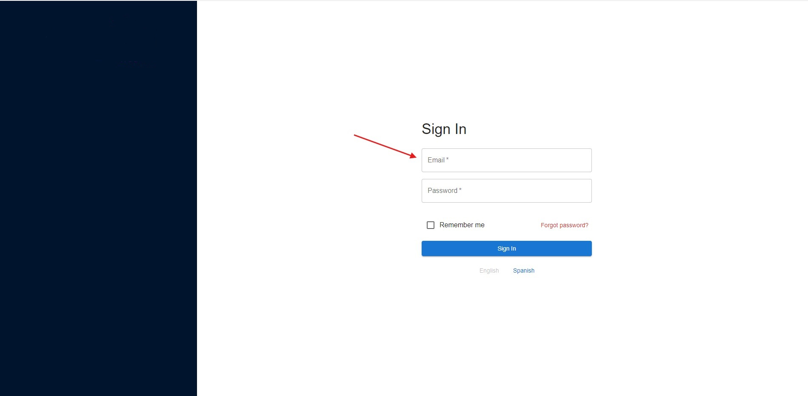
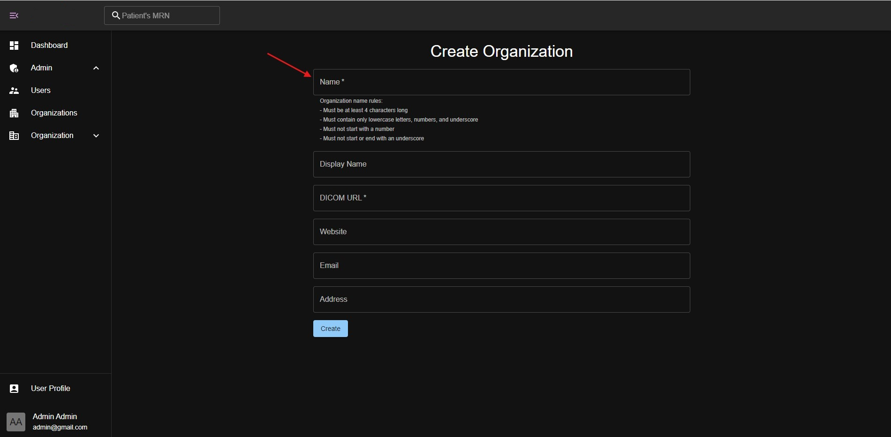
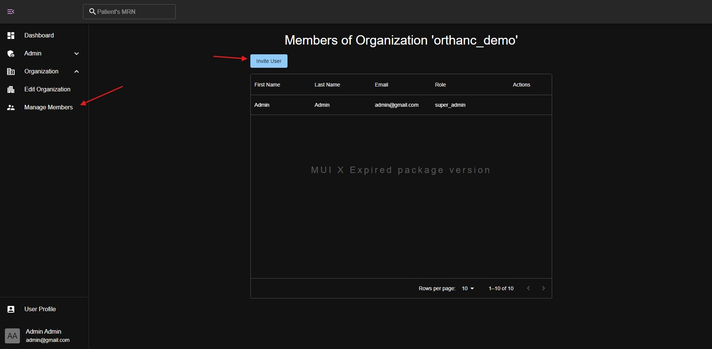
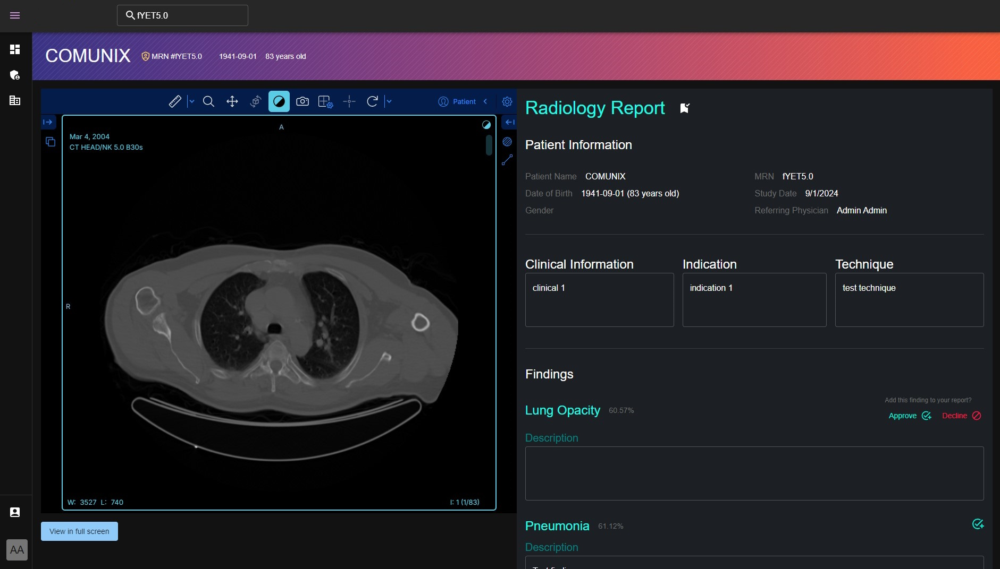

# User Guide

This guide will help you get started to onboard new users and healthcare providers to the platform.

## Healthcare Provider Onboarding

To add a new healthcare provider, the concept of an *organization* is used. An organization can have multiple users and patients associated with it. The organization can be a hospital, clinic, or any other healthcare provider. To add a new organization, you should have the `app_admin` role.
Follow the steps to create a new organization.

1. Log in to the platform with your admin credentials.

2. Click on the **Admin** tab in the sidebar. It will open sub-menu items. Click on the **Organizations** menu item.

3. You will see a list of organizations. Click on the **Add Organization** button to create a new organization.

4. Fill in the organization details such as name, address, phone number, and other details. Click on the **Create** button to create the organization. There are only name and DICOM URL fields required to create an organization. The organization name should be unique. The DICOM URL is used to connect the PACS server with the platform to fetch the patient's medical images. Make sure the provided DICOM URL is accessible from the platform.

### How to add organization admin and regular users

After creating an organization, you can add users to the organization. There are two types of users that can be added to the organization: admin and regular users. The admin user can manage the organization settings, users, and patients. The regular user can only view the patients' data and perform image analysis.

Click on the **Users** menu item in the **Admin** tab. For example, you will see a list of users in entire system. Click on the **Invite User** button to add a new user to the organization. It will open a dialog box to enter the user details. Enter user email address, specify role (`None` or `Organiation Admin`), and search for the organization name in the autocomplete field. Click on the **Invite** button to send an invitation to the user. The user will receive an email with an invitation link to join the organization. If the user doesn't have an account, they will be asked to create an account first.

Adding a regular user is similar to adding an admin user. The only difference is the role selection. Select the `None` role to add a regular user.

Organization admins can also invite users to the organization by clicking on the **Invite User** button in the **Manage Members** menu item from the sidebar menu.

> [!NOTE]  
> The **Admin** menu in the sidebar is only visible to the users with the `app_admin` role.
> The **Organization** menu is only visible to the users with the `organization_admin` role.

## Roles

The platform has the following roles:

- `super_admin`: The super admin role that has access to all functionalities in the system. This role is not visible in the UI. Only developers have access to this role to manage the system settings and troubleshoot issues.
- `app_admin`: The highest admin role that has access to all the organizations and users in the system. This role can create new organizations, users, and manage the system settings.
- `org_admin`: The admin role for the organization. This role can manage the organization settings, users, and patients.

## How to use the platform

After onboarding the healthcare providers and users, they can use the platform to view patients' data and medical images. To search for a particular patient, type Patient ID in the search bar at topbar. It will show the patient DICOM studies and series. Click on the **+** icon to view patient's series associated with the study. Click on **Load in Viewer** button to view the medical images in the viewer.

You will see the OHIF viewer with the patient's medical images. You can use the tools in the viewer to annotate the images. The viewer has tools such as zoom, pan, windowing, and measurement tools. It looks like this:

### How to analyze the medical images using ML models

When you click the **Scan** button in the patient series table, it will send the series data to the backend server then backend server will send the series data to the ML server to perform the prediction. The ML server will predict the disease based on the input data and send the result back to the platform. After the prediction is done, the result will be available in the patient series table. You will see **View Report** button in the table. Click on the button to view the radiology report.

